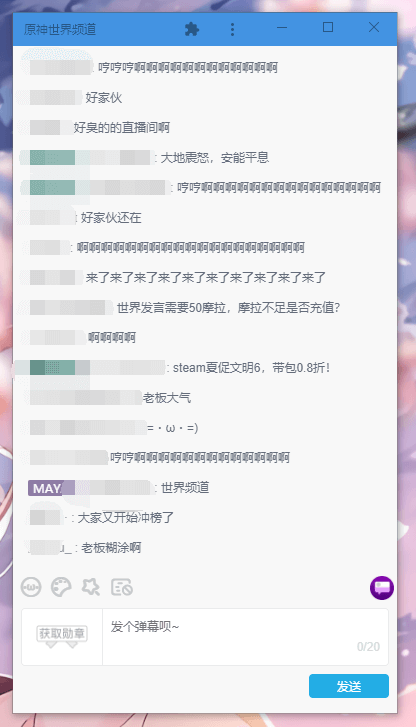

# 原神世界频道

## 简介
在浏览器窗口宽度拉小后，隐藏没用的直播功能，只保留原神世界聊天功能。

用户脚本：https://biuuu.github.io/YSSJPD/index.user.js

## 使用
1. 建议使用 Chrome 或新 Edge，首先安装 [Violentmonkey](https://violentmonkey.github.io/get-it) 扩展或者 [Tampermonkey](https://www.tampermonkey.net/) 扩展
2. 点击脚本链接 https://biuuu.github.io/YSSJPD/index.user.js ，没有问题的话，Violentmonkey 或 Tampermonkey 会弹出安装提示，直接安装即可。
3. 在原神直播间刷新浏览器，然后缩小窗口宽度就可以看到效果了。

你还可以给原神直播间创建一个快捷方式，这样就可以隐藏地址栏，就像一个独立的小窗口。

Chrome 创建快捷方式：菜单 -> 更多工具 -> 创建快捷方式 (注意要勾选“在窗口打开”选项)

Edge 创建快捷方式：菜单 -> 应用 -> 将此站点作为应用安装

创建完快捷方式后也要将窗口拉窄才能看到效果。

